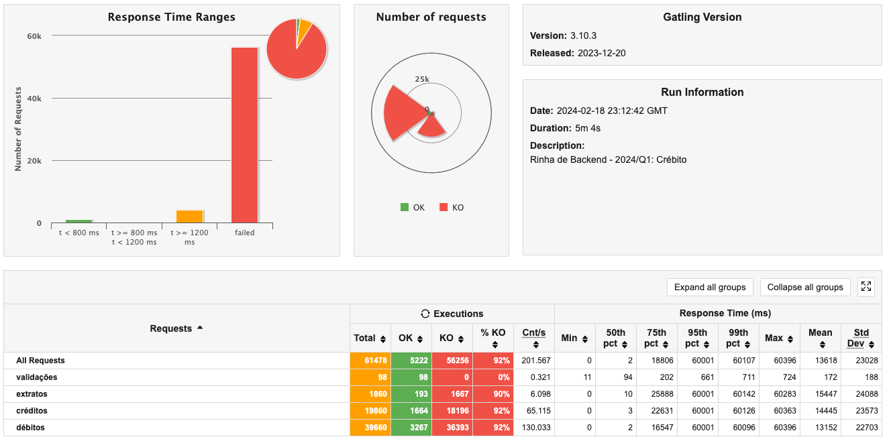

# Rinha de Backend - Django + PostgreSQL



Esta é a minha tentativa de implementar uma solução em django para a [Rinha de Backend](https://github.com/zanfranceschi/rinha-de-backend-2024-q1). Encaro isso mais como uma oportunidade de aprendizado dado que minha experiência com o desenvolvimento de APIs é limitada, assim como meus conhecimentos de Docker.

## Considerações

-   Esta não é uma submissão para ambiente de produção, uma vez que estou usando o built-in dev server do Django.
-   Não estou preocupado exatamente com a performance, mas sim em conseguir completar o projeto e submeter para participar da rinha.
-   Tenho praticamente zero experiência com dev-ops, então aprender docker, como integrar o banco de dados com o django, e entender as particularidades de se fazer o django rodar com o docker tem sido um grande desafio.

## O que aprendi até agora

### Aplicando migrações:

Rodar django em docker tem algumas complexidades, dado que é preciso aplicar database migrations e executar scripts antes da solução ficar disponível para acesso à API. Para rodar as migrações, estou utilizando multiplos shell commands na etapa do command do docker compose:

```docker
web:
    build: .
    command: >
      sh -c "python rinhadjango/manage.py migrate &&
             python rinhadjango/manage.py runserver 0.0.0.0:8000"
    volumes:
      - .:/app
    ports:
      - 8000:8000
    depends_on:
      - db
```

No entanto, existem alguns casos onde o banco de dados ainda não está disponível para o django realizar a migração. Desta forma, é preciso implementar no settings.py:

```python
# Checking if database is ready for migration
DATABASE_READY = False

# At startup
while not DATABASE_READY:
    try:
        django.db.connections['default'].ensure_connection()
    except Exception:
        time.sleep(1)
    else:
        DATABASE_READY = True

# Run migrations now
if not DATABASE_READY:
    print('Applying migrations...')
    os.system('python manage.py migrate')
```

Esta sugestão foi extraída do site [studygyaan.com](https://studygyaan.com/django/applying-django-database-migrations-with-docker-compose)

### Popular o banco de dados previamente

Para a Rinha, é preciso popular a base de clients no banco previamente. Para isso, ao invés de usar um script SQL, usei um script python que usa o ORM do django. No entanto, não é uma trabalho direto como criar um script e rodar, pois o django é uma aplicação isolada. Para isso, é preciso utilizar classes Command. Esse arquivo deve ser criado em app/management/commands/initdb.py:

```python
from ...models import Clientes
from django.core.management import BaseCommand

class Command(BaseCommand):
    def handle(self, **options):

        limites = [1000 * 100, 800 * 100,
                   10000 * 100, 100000 * 100, 5000 * 100]

        for lim in limites:
            cliente = Customer(limite=lim, saldo=0)
            cliente.save()

        verificar = Customer.objects.all()
        print(verificar)
```

E depois este comando ser chamado no shell:

```shell
python manage.py initdb
```

Mas como queremos implementar essa funcionalidade quando fizermos o docker-compose up, essa alteração no arquivo docker-compose.yml foi necessária:

```docker
  web:
    build: .
    command: >
      sh -c "python rinhadjango/manage.py migrate &&
             python rinhadjango/manage.py initdb &&
             python rinhadjango/manage.py runserver 0.0.0.0:8000"
    volumes:
      - .:/app
    ports:
      - 8000:8000
    depends_on:
      - db
```

Você pode encontrar mais informações sobre classes Command na [documentação](https://docs.djangoproject.com/en/dev/howto/custom-management-commands/) do Django.

### Cuidado ao renomear campos nos modelos do Django

As migrações deram problema aqui quando tentei renomear campos e ao apagar os arquivos de migração para começar do zero, comecei a ter um problema onde as tabelas referentes aos Modelos não eram mais criadas.

> Depois de muito tempo procurando uma solução, entendi que eu não poderia deletar a pasta migrations. Desta forma, criei uma nova pasta migrations e adicionei `__init__.py` nele. Problema resolvido (depois de 3 horas procurando pela solução!).

### Para evitar as inconsistências de requisições concorrentes

Após completa a aplicação e rodar o teste com gatling, tive problemas na validação por conta de requisições concorrentes, gerando saldos negativos, o que fere as regras de negócio. Depois de uma [ajuda boa da comunidade](https://x.com/danilosr86/status/1759061055295176977?s=20) consegui encontrar uma solução para o django.

Ao construir a View do endpoint de transacoes, tive que executar as operações de banco de dados dentro de uma transação utilizando `transaction.atomic()`. Além disso, ao invés de utilizar `Customers.objects.get()` para consultar o cliente no banco, utilizei `Customer.objects.select_for_update()` para adicionar um lock no registro até que todas as operações sejam finalizadas ([django-docs](https://docs.djangoproject.com/en/5.0/ref/models/querysets/#select-for-update)).

```python
class AddTransaction(APIView):
    def post(self, request, pk):
        with transaction.atomic():
            customer = get_object_or_404(
                Customer.objects.select_for_update(),
                id=pk
            )

            input_data = request.data
            input_data['cliente'] = customer.id
            input_serializer = TransactionSerializer(data=input_data)

            if input_serializer.is_valid():
                novo_valor = input_serializer.validated_data['valor']
                tipo = input_serializer.validated_data['tipo']

                if (tipo == 'd'):
                    novo_saldo = customer.saldo - novo_valor
                    if (novo_saldo < (-1 * customer.limite)):
                        return Response({"mensagem": "Limite insuficiente", "saldo": customer.saldo, "limite": customer.limite}, status=status.HTTP_422_UNPROCESSABLE_ENTITY)
                else:
                    novo_saldo = customer.saldo + novo_valor

                input_serializer.save()
                customer.saldo = novo_saldo
                customer.save()
                return Response({"limite": customer.limite, "saldo": novo_saldo}, status=status.HTTP_200_OK)
            else:
                return Response(input_serializer.errors, status=status.HTTP_422_UNPROCESSABLE_ENTITY)
```

## Próximos Passos?

Se você não me conhece, sou cientista de dados com mais de 12 anos de experiência mas Dev em formação. Não tenho a pretensão de conseguir completar a rinha e disponibilizar uma aplicação de altíssima performance (como muitos estão fazendo e mostrando no Twitter). Mas já fico satisfeito de ter completado as validações e aprendido tanto em tão pouco tempo.